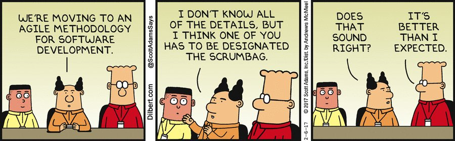

### What is it?

* This course focuses on turning your ad-hoc software development process into 
  something that has process.  We'll be focusing on Agile methodologies.

### What is it?

* Non-technical subject
  * wow no coding? (well it's linked to SE-2223 and SE-2226)
  * SE-2223 super-technical (Software Architecture)
  * SE-2226 somewhat technical (Software Testing)
* Teaches Agile and Scrum project management
* ~~Essay~~ discussion-type quizzes, activities, and exams
  * Surprised? 😲😲😲
  * Don't wanna call it essay, (implies opinion-based answers)
  * Answer these question types based on facts
* Use processes learned for final project

### What we'll learn? (1/7)

 <!-- .element style="width: 600px; height: 450px" -->

History lesson <!-- .element style="font-size: 0.75em" --> + _"Software crisis"_ 
that lead to [1968 NATO SE Conf](https://en.wikipedia.org/wiki/NATO_Software_Engineering_Conferences)

### What you'll learn? (2/7)

 <!-- .element style="width: 600px; height: 450px" -->

Software development life cycles (SDLC) and methodologies   <!-- .element style="font-size: 0.75em" -->

### What you'll learn? (3/7)

<iframe width="560" height="315" src="https://www.youtube.com/embed/sy0-VhKAr7s" frameborder="0" allow="accelerometer; autoplay; clipboard-write; encrypted-media; gyroscope; picture-in-picture" allowfullscreen></iframe>

Agile and Scrum, in deep detail

### Pre-requisites

* SE 2124 - Software Processes and Tools

* Pre-requisite knowledge:
  - Standish CHAOS intro activity
  - Git and migrations for teamwork
  - Unit testing and ESLint for code quality

### Which courses need SE 2225 as a prereq?

* SE 3123 - Software Development Laboratory I
  * client-based serious, real-world project
    * client of current SE-3 team  
      
  * also needs SE 2223 and SE 2226
  * it's only offered every first semester, unless retakers can form one team
    and willing to pay special class fees