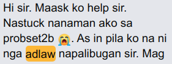
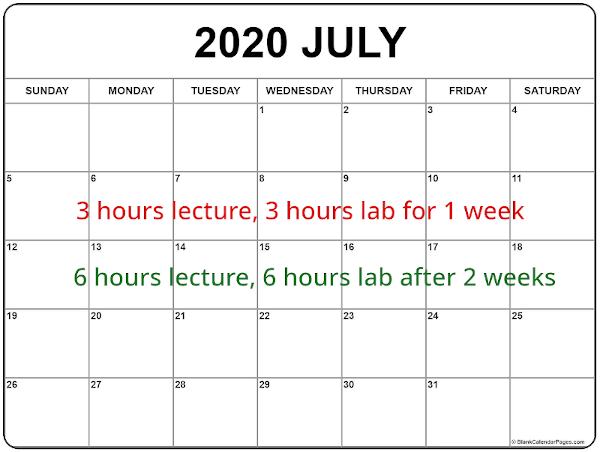

### SE-2225 is a full-term course (1/2)

 <!-- .element style="width: 530px; height: 200px;" -->

+ We learned during the first semester that subterms are not SE-friendly.
  - 3 days is equivalent to 2-weeks on a regular semester
    * Since classes are compressed from 18 weeks to 5+ weeks
    * 2-hour classes per day means 6-hours in just 3 days
    * 6-hours is 2 weeks worth of lecture in a regular sem

### Regular Pace

### 3-Subterm / Summer Pace

+ <!-- .element style="font-size: 0.55em" --> <em>"summer"</em> classes have the same pace as the 3-subterm style last sem 
  - in _"quotes"_ since COVID-19 forced a calendar shift

### SE-2225 is a full-term course (2/2)

* No distinction between lecture and lab
* Short lecture, few examples, and then problem set
  - it serves as your lab component along with final project
* In a normal semester, SE-2225 is 2-hours lecture and 3-hours lab per week
  - For this semester, SE-2225 is:
    + 4-hours _"lecture"_ for the first subterm (10:00-12:00 PM ThF)
    + 6-hours _"lab"_ for the second subterm (1:00-4:00 PM ThF)
* BUT AGAIN, no distinction between lecture and lab
  - loopholey and ninja-ish, but it's for your own good 😅