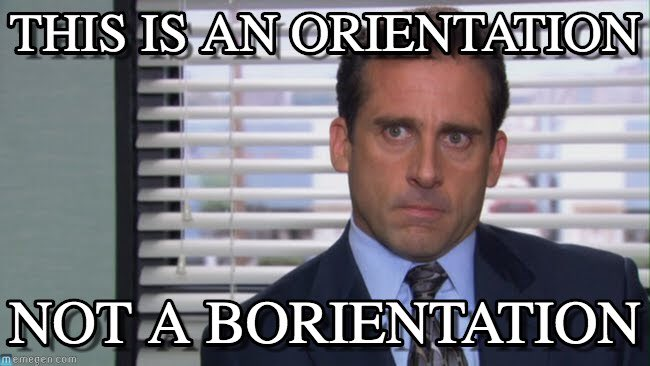

Orientation
===========

<small>
  &lt;/&gt;
  <a href="https://github.com/psse-cpu/se-2225-orientation-slides">
    https://github.com/psse-cpu/se-2225-orientation-slides
  </a>
</small>

<h4 style="margin-top: 192px; font-size: 0.85em;">
  SE 2225
  Software Engineering Processes
</h4>

  <b>Richard Michael Coo</b> |

  
  
  @myknbani

Welcome to SE-2225
------------------

### Software Engineering Process

Outline
-------

* course description
* course outline
* pre-requisites
  - courses
  - knowledge
* which courses need SE 2225?
* subterm vs semester pace
* house rules